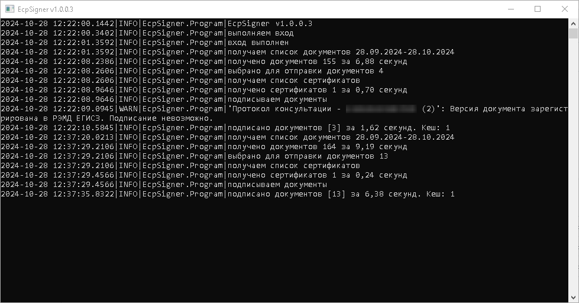

# О программе
EcpSigner - консольная утилита для автоматического подписания документов от медицинской организации в ЕЦП (Единая цифровая платформа).

Порядок подписания документов в программе такой же, как на портале ЕЦП в разделе "Региональный РЭМД"

Утилита поддерживает подписание только через КриптоПро.

  
Пример работы

  Запуск без параметров:

  

  Программа взяла месяц с текущего дня, получила 155 документов, выбрала те, которые нужно подписывать (4 документа), нашла у пользователя сертификат и подписала 3 документа. Через 15 минут все действия были повторены, и были подписаны ещё 13 документов. При подписании 1 документа была получена ошибка, в следующих попытках подписания программа их будет его игнорировать.

## Зачем эта утилита
Встроенное в ЕЦП "Пакетное подписание данных ЭП" требует от администратора медицинской организации регулярного выполнения однотипных действий. Кроме того, при большом количестве документов пакетное подписание начинает работать очень медленно. За подписанием документов приходится постоянно следить, что мешает нормальной работе.

EcpSigner достаточно запустить и документы будут подписываться автоматически. Программа подписывает документы в несколько раз быстрее пакетного подписания в ЕЦП: ~2 документа в секунду. Ограничения по количеству документов нет.

## Требования
* .Net 4.+
* КриптоПро ЭЦП Browser plug-in 2.0 ([ссылка](https://cryptopro.ru/products/cades/downloads), требуется зарегистрироваться)
* Доступ к порталу ЕЦП
* Версия ЕЦП prmd.10.17+ (на более ранних тоже может работать)

## Настройка и установка
* Установите сертификат МО в хранилище сертификатов пользователя в раздел "Личное". Проверьте, что установлены все сертификаты из пути сертификации.
* Скачайте архив с последней версией утилиты на странице [релизов](https://github.com/alkrev/EcpSigner/releases)
* Распакуйте архив в папку с доступом на запись
* Переименуйте файл config.json.example в config.json
* Откройте config.json в текстовом редакторе, введите логин и пароль администратора МО, проверьте адрес сайта ЕЦП и измените, если он у вас другой.
* Опционально: [настройте игнорируемые типы документов](https://github.com/alkrev/EcpSigner/wiki/%D0%9D%D0%B0%D1%81%D1%82%D1%80%D0%BE%D0%B9%D0%BA%D0%B0-%D0%B8%D0%B3%D0%BD%D0%BE%D1%80%D0%B8%D1%80%D1%83%D0%B5%D0%BC%D1%8B%D1%85-%D1%82%D0%B8%D0%BF%D0%BE%D0%B2-%D0%B4%D0%BE%D0%BA%D1%83%D0%BC%D0%B5%D0%BD%D1%82%D0%BE%D0%B2)
* Опционально: настройте логгирование в NLog.config (утилита использует [Nlog](https://nlog-project.org/))

## Запуск
* Запустите EcpSigner.exe - утилита будет получать документы за последний месяц. Это рекомендуемый вариант для непрерывной работы.
* EcpSigner.exe {ДАТА} - получение документов за конкретный день (пример: EcpSigner.exe 17.10.2024)
* EcpSigner.exe {ДАТА} {ДАТА} - получение документов за диапазон дат (пример: EcpSigner.exe 16.10.2024 17.10.2024)

## Подробнее
[Описание работы программы](https://github.com/alkrev/EcpSigner/wiki#description)
